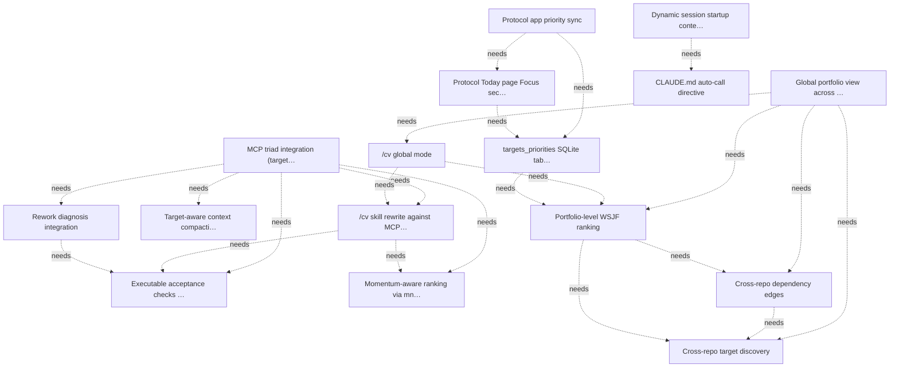

# Targets

## Active

### 🎯T1 MCP triad integration (targets + sawmill + mnemo)
- **Value**: 13
- **Cost**: 8
- **Acceptance**:
  - targets_verify tool executes sawmill checks against acceptance criteria
  - /cv skill calls targets_rank + mnemo_recent_activity instead of parsing markdown
  - Rework diagnosis includes sawmill failure report and mnemo session history
- **Context**: Design note: docs/mcp-triad.md. The three MCP servers (targets, sawmill, mnemo) each own a distinct concern (plan, code, history). Integrating them replaces the monolithic /cv skill with composable typed tool calls — faster, deterministic, and testable. The highest-value integration point is the /cv skill rewrite (step 3 in the design note).

- **Depends on**: 🎯T1.1, 🎯T1.2, 🎯T1.3, 🎯T1.4, 🎯T1.5
- **Tags**: integration, architecture
- **Status**: Identified
- **Discovered**: 2026-04-07

### 🎯T1.1 Executable acceptance checks via sawmill
- **Value**: 8
- **Cost**: 5
- **Acceptance**:
  - Target schema has optional checks field (convention, query, invariant types)
  - targets_verify tool iterates checks and calls sawmill tools
  - Structured pass/fail report with file/line-level detail
- **Context**: Phase 1 uses sawmill's existing check_conventions and query tools. Phase 2 adds structural invariants when sawmill T19 lands. See docs/mcp-triad.md section 1.

- **Tags**: sawmill
- **Status**: Identified
- **Discovered**: 2026-04-07

### 🎯T1.2 Momentum-aware ranking via mnemo
- **Value**: 5
- **Cost**: 3
- **Acceptance**:
  - targets_rank accepts optional momentum signal
  - Ranking integrates session recency and frequency from mnemo_recent_activity
  - Momentum factor is tunable, not hardcoded
- **Context**: Static WSJF ranking ignores whether a target is actively being worked on or has been stale for weeks. mnemo_recent_activity provides the signal; the /cv skill merges it with targets_rank output. See docs/mcp-triad.md section 2.

- **Tags**: mnemo
- **Status**: Identified
- **Discovered**: 2026-04-07

### 🎯T1.3 /cv skill rewrite against MCP tools
- **Value**: 8
- **Cost**: 3
- **Acceptance**:
  - /cv calls targets_frontier + targets_rank (no markdown parsing)
  - /cv optionally calls mnemo_recent_activity for momentum
  - Total tool calls bounded (3-6), no unbounded agent exploration
  - Output quality matches or exceeds current /cv
- **Context**: Highest-value integration point — immediate daily workflow improvement. The skill shrinks from ~200 lines to ~20 lines of tool orchestration. See docs/mcp-triad.md section 5.

- **Depends on**: 🎯T1.1, 🎯T1.2
- **Tags**: skill
- **Status**: Identified
- **Discovered**: 2026-04-07

### 🎯T1.4 Target-aware context compaction
- **Value**: 5
- **Cost**: 3
- **Acceptance**:
  - mnemo summarizer calls targets_list to anchor compaction output
  - Compaction includes targets_active, targets_progressed, targets_next fields
  - mnemo_restore returns structured target context
- **Context**: Depends on mnemo T10 (live context compaction). The summarizer speaks the language of the target graph instead of free-text. See docs/mcp-triad.md section 3.

- **Tags**: mnemo
- **Status**: Identified
- **Discovered**: 2026-04-07

### 🎯T1.5 Rework diagnosis integration
- **Value**: 5
- **Cost**: 5
- **Acceptance**:
  - Verify target failure includes sawmill structural failure report
  - Rework diagnosis includes mnemo prior-attempt history
  - Combined diagnosis is passed as targets_rework payload
- **Context**: The rework agent gets maximum context: what failed (sawmill), what was tried before (mnemo), and retry budget status (targets). See docs/mcp-triad.md section 4.

- **Depends on**: 🎯T1.1
- **Tags**: sawmill, mnemo
- **Status**: Identified
- **Discovered**: 2026-04-07

### 🎯T2 Global portfolio view across all repos
- **Value**: 13
- **Cost**: 8
- **Acceptance**:
  - targets_portfolio tool discovers and loads targets.yaml from all managed repos
  - Cross-repo dependency edges are explicit and surfaced in ranking
  - Portfolio-level WSJF ranking orders repos by aggregate priority
  - /cv global presents top repos, per-repo frontier, cross-repo blockers
- **Context**: Design note: docs/mcp-triad.md section 6. Within a repo, agent capacity is unlimited and the state machine optimises for parallel throughput. Across repos, human attention is the scarce resource — WSJF returns as the scheduling primitive. The global view meshes per-repo target graphs into a cross-repo quasi-graph with explicit dependency edges, momentum signals from mnemo, and portfolio-level ranking.

- **Depends on**: 🎯T2.1, 🎯T2.2, 🎯T2.3, 🎯T2.4
- **Tags**: portfolio, architecture
- **Status**: Identified
- **Discovered**: 2026-04-07

### 🎯T2.1 Cross-repo target discovery
- **Value**: 5
- **Cost**: 3
- **Acceptance**:
  - Discovers targets.yaml from managed-repos.md and ~/work/ walk
  - Loads and validates each repo's target graph independently
  - Handles missing/invalid files gracefully (skip with warning)
- **Context**: Sources: ~/.claude/managed-repos.md (canonical), ~/work/ walk (fallback), mnemo_repos (enrichment for recently-active repos not in managed list).

- **Tags**: portfolio
- **Status**: Identified
- **Discovered**: 2026-04-07

### 🎯T2.2 Cross-repo dependency edges
- **Value**: 8
- **Cost**: 5
- **Acceptance**:
  - Schema supports cross_depends and cross_enables fields with repo + capability/target refs
  - Cross-repo edges surfaced in targets_portfolio output
  - Targets enabling work in other repos get a priority boost
- **Context**: Manual cross_depends/cross_enables fields are accurate but high-friction. Future enrichment: mnemo could detect cross-repo references automatically from sessions that reference another repo's targets. Start manual.

- **Depends on**: 🎯T2.1
- **Tags**: portfolio
- **Status**: Identified
- **Discovered**: 2026-04-07

### 🎯T2.3 Portfolio-level WSJF ranking
- **Value**: 8
- **Cost**: 5
- **Acceptance**:
  - Repos ranked by aggregate frontier weight adjusted for momentum
  - Cross-repo enablers get value propagation boost
  - targets_portfolio returns ranked repos with per-repo frontier and reasoning
  - Momentum from mnemo_recent_activity integrated into ranking
- **Context**: Aggregate score: sum(frontier_weight * momentum) / frontier_size. Repos with more frontier targets are more parallelisable and need less per-unit human attention. Cross-repo enablers propagate value from downstream repos. See docs/mcp-triad.md section 6.

- **Depends on**: 🎯T2.1, 🎯T2.2
- **Tags**: portfolio, mnemo
- **Status**: Identified
- **Discovered**: 2026-04-07

### 🎯T2.4 /cv global mode
- **Value**: 5
- **Cost**: 3
- **Acceptance**:
  - "/cv global" runs portfolio-level evaluation
  - Presents top 1-3 repos with reasoning
  - Shows cross-repo blockers and enablers
  - Includes momentum report (active vs stale repos)
- **Context**: Heavier than single-repo /cv (discovers repos, loads multiple YAML, calls mnemo). Runs on explicit request or at session start when no specific repo context.

- **Depends on**: 🎯T2.3, 🎯T1.3
- **Tags**: skill, portfolio
- **Status**: Identified
- **Discovered**: 2026-04-07

### 🎯T3 Protocol app priority sync
- **Value**: 8
- **Cost**: 8
- **Acceptance**:
  - targets_portfolio output written to a targets_priorities SQLite table
  - sqlpipe replicates priorities to Protocol's protocol.db via pigeon
  - Protocol Today page shows Focus section with top frontier targets
  - Sync runs periodically (cron or daemon hook)
- **Context**: Design note: docs/mcp-triad.md section 7. The portfolio ranking should surface on the phone so the user sees top priorities when they pick up their phone. The sync chain is: targets_portfolio → SQLite table → sqlpipe over pigeon → Protocol Today page. Protocol already uses SQLite for all storage. jevon T10 tracks the same sqlpipe-over-pigeon pattern for jevon's mobile app — same infrastructure.

- **Depends on**: 🎯T3.1, 🎯T3.2
- **Tags**: protocol, mobile
- **Status**: Identified
- **Discovered**: 2026-04-07

### 🎯T3.1 targets_priorities SQLite table and writer
- **Value**: 5
- **Cost**: 3
- **Acceptance**:
  - targets_portfolio output upserted into targets_priorities table
  - Table schema includes repo, name, weight, context, horizon, updated_at
  - Periodic refresh via cron or daemon hook
- **Context**: Laptop-owned table. Protocol is read-only. Horizon field (today/tomorrow/ this_week) maps to Protocol's daily view paging.

- **Depends on**: 🎯T2.3
- **Tags**: protocol
- **Status**: Identified
- **Discovered**: 2026-04-07

### 🎯T3.2 Protocol Today page Focus section
- **Value**: 5
- **Cost**: 3
- **Acceptance**:
  - Focus section renders above daily checklist
  - Shows top frontier targets with repo, weight, and name
  - Updates on sync without manual refresh
- **Context**: Reads from targets_priorities table in protocol.db. Tapping a priority shows context in a detail sheet. Future: deep-link to repo.

- **Depends on**: 🎯T3.1
- **Tags**: protocol, mobile
- **Status**: Identified
- **Discovered**: 2026-04-07

### 🎯T4 Dynamic session startup context
- **Value**: 8
- **Cost**: 3
- **Acceptance**:
  - mnemo_startup_context tool returns structured context for current project
  - Includes recently active repos with session counts and recency
  - Agent sees recent activity without running /waw or /cv
- **Context**: Design note: docs/mcp-triad.md section 8. High value, low cost — wraps existing mnemo_recent_activity with formatting. Answers "where was I?" at session start. Implementation: Option B (explicit tool call from CLAUDE.md instruction) for now, Option C (MCP resource) when protocol support matures.

- **Depends on**: 🎯T4.1, 🎯T4.2
- **Tags**: mnemo, startup
- **Status**: Identified
- **Discovered**: 2026-04-07

### 🎯T4.2 CLAUDE.md auto-call directive
- **Value**: 3
- **Cost**: 1
- **Acceptance**:
  - Global CLAUDE.md instructs agent to call mnemo_startup_context at session start
  - Context is presented to the agent without user intervention
- **Context**: A one-line addition to ~/.claude/CLAUDE.md. Depends on mnemo_startup_context existing. Low cost, immediate value.

- **Depends on**: 🎯T4.1
- **Tags**: startup
- **Status**: Identified
- **Discovered**: 2026-04-07

## Achieved

### 🎯T4.1 mnemo_startup_context tool
- **Value**: 5
- **Cost**: 2
- **Acceptance**:
  - Returns per-repo summary with session counts, recency, and active targets
  - Formatted for easy agent consumption
  - Filterable by project (current working directory)
- **Context**: Wraps mnemo_recent_activity with target-aware enrichment. If the targets MCP server is available, includes frontier targets per repo. Otherwise falls back to session-only data.

- **Tags**: mnemo
- **Status**: Achieved
- **Discovered**: 2026-04-07
- **Achieved**: 2026-04-09
- **Actual-cost**: 2

### 🎯T5 Migration from markdown targets to bullseye
- **Value**: 8
- **Cost**: 5
- **Acceptance**:
  - All repos using docs/targets.md can be migrated to docs/targets.yaml
  - /cv and related skills work against both old (markdown) and new (bullseye) formats during transition
  - No loss of target history or structure during migration
  - Clear cutover point after which markdown targets are retired
- **Context**: Two dimensions to this migration: technical (format conversion, tool compatibility) and workflow (when does the human switch daily habits).
Technical: converting markdown targets to YAML, dual-format /cv during transition, updating skills and CLAUDE.md directives. Covered by sub-targets.
Workflow: The current system (markdown targets + /cv + manual convergence assessment) works today. Bullseye is better in theory but still rough. The risk is switching too early (bullseye can't do something the old system handles) or too late (maintaining two systems indefinitely). The migration needs a clear "bullseye-first" switchover point — a defined set of capabilities that, once working, make bullseye the default for new work. Before that point, the old system remains primary and bullseye is used experimentally on this repo only. After that point, new repos get targets.yaml and existing repos migrate on next touch.
During the interim (bullseye under development), the old system stays authoritative. Bullseye eats its own dogfood on this repo, but other repos continue with markdown targets. The /cv skill needs to work with both — not as a permanent feature, but as a bridge. The bridge is removed once all active repos are migrated.
Migration strategy: run both systems in parallel. Agents write targets to both markdown and YAML — every target addition, status change, or retirement lands in both places. This lets bullseye prove itself against the live workflow without risk. No bridge code needed in /cv — the old /cv reads markdown as before, and bullseye tools read YAML independently. When bullseye consistently produces equal or better results, stop writing to markdown. This avoids both premature switchover and the complexity of dual-format reading logic.

- **Depends on**: 🎯T5.1, 🎯T5.2
- **Tags**: migration, architecture
- **Status**: Achieved
- **Discovered**: 2026-04-07
- **Achieved**: 2026-04-09
- **Actual-cost**: 5

### 🎯T5.1 Markdown-to-YAML target converter
- **Value**: 5
- **Cost**: 3
- **Acceptance**:
  - bullseye_import tool or standalone script reads docs/targets.md and emits docs/targets.yaml
  - Preserves target IDs, status, value/cost, acceptance criteria, parent/child relationships
  - Handles the common markdown conventions (🎯T prefix, status/weight/acceptance fields)
  - Produces valid YAML that passes bullseye_validate
- **Context**: The markdown format has no formal schema — it's whatever /cv and render.rs produce. The converter needs to be tolerant of minor formatting variations across repos.

- **Tags**: migration
- **Status**: Achieved
- **Discovered**: 2026-04-07
- **Achieved**: 2026-04-09
- **Actual-cost**: 3

### 🎯T5.2 Global CLAUDE.md and skill directives updated for bullseye
- **Value**: 3
- **Cost**: 2
- **Acceptance**:
  - ~/.claude/CLAUDE.md convergence-targets section references bullseye tools
  - Skills that reference targets.md parsing are updated to use bullseye MCP calls
  - No stale references to the old markdown-based workflow remain
- **Context**: The global CLAUDE.md has extensive directives about targets.md format, /cv behaviour, and convergence workflow. These all need updating once bullseye is the primary system. This happens at cutover — when parallel running has built enough confidence to drop markdown.

- **Depends on**: 🎯T5.1
- **Tags**: migration
- **Status**: Achieved
- **Discovered**: 2026-04-07
- **Achieved**: 2026-04-09
- **Actual-cost**: 2

### 🎯T6 Seamless new-user adoption
- **Value**: 8
- **Cost**: 3
- **Acceptance**:
  - A new user can go from "found the repo" to "bullseye is running and useful" with minimal friction
  - No cold-start problem — first interaction produces something useful
  - CLAUDE.md integration is copy-pasteable
- **Context**: A new user arriving at the repo faces several friction points: (1) installation is two steps (binary + MCP config), (2) there's no targets.yaml to start with, so the first tool call fails, (3) the real value comes from skill integration but there's no guidance on how to wire that up. Each sub-target removes one of these barriers.

- **Depends on**: 🎯T6.1, 🎯T6.2, 🎯T6.3
- **Tags**: adoption, ux
- **Status**: Achieved
- **Discovered**: 2026-04-07
- **Achieved**: 2026-04-08
- **Actual-cost**: 3

### 🎯T6.1 bullseye_init tool creates starter targets.yaml
- **Value**: 5
- **Cost**: 2
- **Acceptance**:
  - bullseye_init creates docs/targets.yaml with a sensible skeleton
  - Includes a sample target demonstrating the schema
  - Works from any cwd (creates docs/ directory if needed)
  - Idempotent — refuses to overwrite an existing file
- **Context**: Eliminates the cold-start problem. A new user's first interaction with bullseye produces a working targets file they can immediately build on.

- **Tags**: adoption
- **Status**: Achieved
- **Discovered**: 2026-04-07
- **Achieved**: 2026-04-08
- **Actual-cost**: 2

### 🎯T6.2 Auto-create targets.yaml on first bullseye_add
- **Value**: 3
- **Cost**: 2
- **Acceptance**:
  - bullseye_add creates docs/targets.yaml if it doesn't exist
  - The created file contains only the added target (no sample data)
  - Other mutation tools (update, retire) still error on missing file
- **Context**: Complementary to bullseye_init. If an agent calls bullseye_add before init, it should just work rather than erroring. This makes the tool more forgiving in agentic workflows where the agent may not know to call init first.

- **Tags**: adoption
- **Status**: Achieved
- **Discovered**: 2026-04-07
- **Achieved**: 2026-04-07
- **Actual-cost**: 2

### 🎯T6.3 Copy-pasteable CLAUDE.md snippet for target management
- **Value**: 3
- **Cost**: 1
- **Acceptance**:
  - README and agents-guide include a CLAUDE.md section users can paste into their project
  - The snippet tells agents to use bullseye tools for target management
  - Works standalone — doesn't require other skills or setup
- **Context**: The snippet bridges the gap between "bullseye is installed as an MCP server" and "agents actually use it." Without explicit CLAUDE.md instructions, agents won't know bullseye exists even if it's registered.

- **Tags**: adoption, docs
- **Status**: Achieved
- **Discovered**: 2026-04-07
- **Achieved**: 2026-04-07
- **Actual-cost**: 1

## Graph

